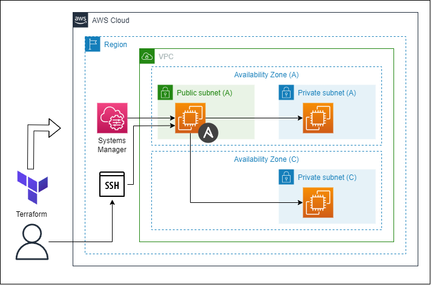

# terraform-ansible-for-ec2
EC2上でAnsibleをセットアップします。
<br>
クライアント用EC2のインベントリ作成までできるので、プレイブックを作成すればすぐに使える状態になります。
<br>
また管理用サーバへのアクセスは、sshかSession Managerで可能です。


# 構成図
<p>

</p>

# 使い方

(1) terraformコマンドでapplyします。
```
$ terraform init
$ terraform apply
```

(2) Outputs:に出力されたコマンドで管理用サーバに接続します。
```
ssh_command = "ssh -i ./.key_pair/ansible-key.id_rsa ec2-user@XXX.XXX.XXX.XXX"
ssm_command = "aws ssm start-session --target i-XXXXXXXXXXXXXXXXX --region ap-northeast-1"
```

(3) ansible-inventory コマンドでインベントリの状況を確認します。
```
$ sudo su ec2-user
$ cd ~/ansible/
$ ansible-inventory -i aws_ec2.yml --graph
```
出力例：
```
@all:
  |--@ungrouped:
  |--@aws_ec2:
  |  |--terraform-ansible-for-ec2-client-1a
  |  |--terraform-ansible-for-ec2-server
  |  |--terraform-ansible-for-ec2-client-1c
  |--@tag_Name_web:
  |  |--terraform-ansible-for-ec2-client-1a
  |--@tag_Name_batch:
  |  |--terraform-ansible-for-ec2-client-1c
```

(4) サンプル用のAnsibleプレイブックを実行します。
　　正常に実行できれば、対象EC2のタグが取得できます。
```
$ ansible-playbook -i aws_ec2.yml playbook.yml -e "target_hosts=tag_Name_web"
$ ansible-playbook -i aws_ec2.yml playbook.yml -e "target_hosts=tag_Name_batch"
```
出力例：
```
PLAY [Sample dynamic inventory] *******************************************************************************************************************************************************************

TASK [Gathering Facts] *****************************************************************************************************************************************************************************
[WARNING]: Platform linux on host terraform-ansible-for-ec2-client-1a is using the discovered Python interpreter at /usr/bin/python3.9, but future installation of another Python interpreter could
change the meaning of that path. See https://docs.ansible.com/ansible-core/2.14/reference_appendices/interpreter_discovery.html for more information.
ok: [terraform-ansible-for-ec2-client-1a]

TASK [Print Name tag] ******************************************************************************************************************************************************************************
ok: [terraform-ansible-for-ec2-client-1a] => {
    "msg": "terraform-ansible-for-ec2-client-1a"
}

PLAY RECAP *****************************************************************************************************************************************************************************************
terraform-ansible-for-ec2-client-1a : ok=2    changed=0    unreachable=0    failed=0    skipped=0    rescued=0    ignored=0
```

# ライセンス
[Mozilla Public License v2.0](https://github.com/Lamaglama39/terraform-for-aws/blob/main/LICENSE)

# 素材クレジット
- <a target="_blank" href="https://icons8.com/icon/WncR8Bcg5nE9/terraform">Terraform</a> icon by <a target="_blank" href="https://icons8.com">Icons8</a>
- <a target="_blank" href="https://icons8.com/icon/iGCCE2iEmh2u/ansible">Ansible</a> icon by <a target="_blank" href="https://icons8.com">Icons8</a>
- <a target="_blank" href="https://icons8.com/icon/31973/ssh">SSH</a> icon by <a target="_blank" href="https://icons8.com">Icons8</a>