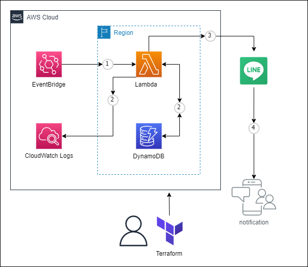

# terraform-line-bot
シンプルなサーバーレス構成でLine Botを作成できます。
<br>
ゴミ出しなどの定期的な通知目的であれば、ほぼそのまま利用できます。

# 構成図
<p>

</p>

# 事前準備
- Line Developers でアカウントを作成し、クレデンシャル情報を取得してください。
<br>
[Line Developers](https://developers.line.biz/ja/)

# 使い方

(1)「variables.tf」のlineクレデンシャル情報を設定します。
<br>※記載するのに抵抗があれば、terraform apply実行時に入力してください
```
# line クレデンシャル情報
variable "api_url" {}
variable "token_event" {}
variable "token_garbage" {}
variable "user_id" {}
```

(2)「./dynamodb_config/」配下のファイルに、JSON形式で通知したい内容を追記します。

(3)terraformコマンドでapplyします。
```
$ terraform init
$ terraform apply
```

(4)Outputs:に出力されたLambda名を以下のコマンドで実行して成功することをテストしてください。
```
$ aws lambda invoke --function-name ${lambda-name} --payload '{ "name": "test" }' response.json
```
成功例：
```
{
    "StatusCode": 200,
    "ExecutedVersion": "$LATEST"
}
```

# ライセンス
[Mozilla Public License v2.0](https://github.com/Lamaglama39/terraform-for-aws/blob/main/LICENSE)

# 素材クレジット
- <a target="_blank" href="https://icons8.com/icon/WncR8Bcg5nE9/terraform">Terraform</a> icon by <a target="_blank" href="https://icons8.com">Icons8</a>
- <a target="_blank" href="https://icons8.com/icon/0ZWDaCvmIF4I/line">Line</a> icon by <a target="_blank" href="https://icons8.com">Icons8</a>