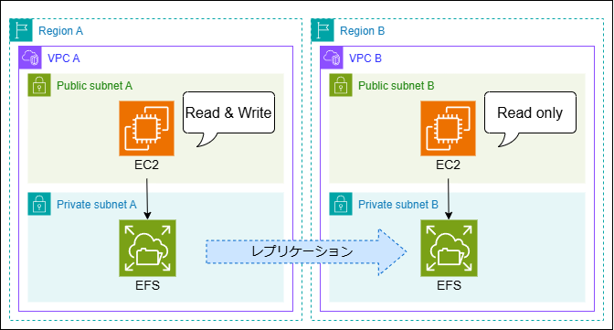

# multi-region-efs
レプリケーションを有効化したEFSを作成し、それぞれのリージョンのEC2でマウントします。  
ユーザーデータで/efs/fstabの設定を行うため、構築が完了した段階でEFSが利用できます。  
またEC2へ`ssh`か`Session Manager`で接続可能です。

# 構成図
<p>

</p>

# 使い方

(1) 以下の順でリソースを作成してください。
```
$ terraform init
$ terraform apply --target=module.vpc --target=module.vpc_replica
$ terraform apply
```

(2) Outputs:に出力されたコマンドでEC2へ接続します。
```
$ terraform output
```
```
CONNECT_EC2_SSH = [
  "ssh -i ./.key_pair/multi-region-efs ec2-user@XXX.XXX.XXX.XXX.ap-northeast-1.compute.amazonaws.com",
]
CONNECT_EC2_SSM = [
  "aws ssm start-session --target i-XXXXXXXXXXXXXXXXX --region ap-northeast-1",
]
```

(3) 以下コマンドでEFSがマウントされていることを確認できます。
```
$ df -h
```

(4) 以下の順でリソースを削除してください。
```
$ terraform destroy --target=module.efs
```
レプリケーション側のEFSはterraformで削除できないため、以下コマンドで削除してください。
```
$ REPLICA_EFS_ID=$(aws efs describe-file-systems --region ap-northeast-3 --output text --query 'FileSystems[*].FileSystemId')
$ REPLICA_EFS_MOUNT_TARGET=$(aws efs describe-mount-targets --file-system-id $REPLICA_EFS_ID --region ap-northeast-3 --output text --query 'MountTargets[*].MountTargetId')
$ aws efs delete-mount-target --mount-target-id $REPLICA_EFS_MOUNT_TARGET --region ap-northeast-3
$ aws efs delete-file-system --file-system-id $REPLICA_EFS_ID --region ap-northeast-3
```
レプリケーション側のEFSの削除が完了すれば、以下コマンドで全リソースを削除できます。
```
$ terraform destroy
```

# ライセンス
[Mozilla Public License v2.0](https://github.com/Lamaglama39/terraform-for-aws/blob/main/LICENSE)
