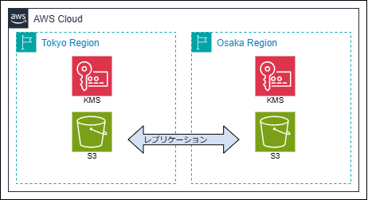

# s3-bidirectional-replication
S3サーバー側の暗号化方式ごとのレプリケーション設定の違いを確認する。
以下暗号化方式での双方向レプリケーションを検証済み。

* SSE-S3
* SSE-KMS
* DSSE-KMS
* SSE-C

## 構成図
<p>

</p>

## 使い方
(1) リソース作成
```
terraform apply
```

(2) リソース削除
```
terraform destroy
```

## SSE-C
(1) 環境変数、試験用ファイル作成
```
echo "test text" > test.txt
SSE_CUSTOMER_KEY=$(openssl rand -hex 16)
S3_TOKYO=$(terraform state show module.s3_primary.aws_s3_bucket.main | grep -E "bucket " | awk '{print $3}' | sed s/\"//g)
S3_OSAKA=$(terraform state show module.s3_secondary.aws_s3_bucket.main | grep -E "bucket " | awk '{print $3}' | sed s/\"//g)
```

(2) ファイルアップロード
```
aws s3 cp test.txt "s3://${S3_TOKYO}" \
    --sse-c AES256 \
    --sse-c-key $SSE_CUSTOMER_KEY
```

(3) ファイルダウンロード
```
aws s3 cp "s3://${S3_TOKYO}/test.txt" ./tokyo \
    --sse-c AES256 \
    --sse-c-key $SSE_CUSTOMER_KEY
```
```
aws s3 cp "s3://${S3_OSAKA}/test.txt" ./osaka \
    --sse-c AES256 \
    --sse-c-key $SSE_CUSTOMER_KEY
```

## ライセンス
[Mozilla Public License v2.0](https://github.com/Lamaglama39/terraform-for-aws/blob/main/LICENSE)
