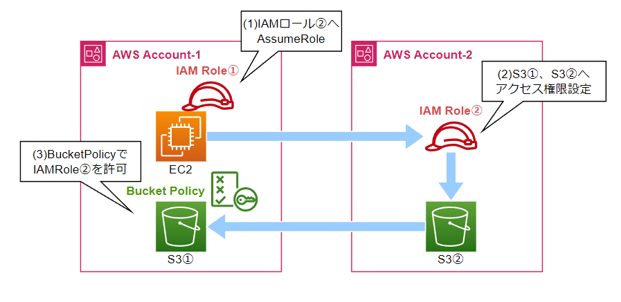

# s3-multi-account-deploy
S3クロスアカウント連携用の環境を構築します。
<br>
検証などでご利用ください。


# 構成図
## ①AssumeRoleを利用しないパターン
<p>

</p>

## ②AssumeRoleを利用するパターン
<p>

</p>

# 使い方

(1) Terraform実行環境の$HOME/.aws/configに、デプロイ用の各アカウントのIAMロールを設定してください。
```
[default]
region=ap-northeast-1
output=json

[profile account1]
role_arn = arn:aws:iam::<アカウント①ID>:role/<IAM Role名>
source_profile = default

[profile account2]
role_arn = arn:aws:iam::<アカウント②ID>:role/<IAM Role名>
source_profile = default
```


(2) providers.tfのprofileに、$HOME/.aws/configで設定したProfile名を設定してください。
```
# アカウント1用のプロバイダー
provider "aws" {
  alias   = "account1"
  region  = "ap-northeast-1"
  profile = "account1"
}

# アカウント2用のプロバイダー
provider "aws" {
  alias   = "account2"
  region  = "ap-northeast-1"
  profile = "account2"
}
```

(3) terraformコマンドでapplyします。
```
$ terraform init
$ terraform apply
```

(4) Outputs:に出力されたEC2へ接続します。
```
ssm_command_BucketPolicy = "aws ssm start-session --target ${aws_instance.ec2_1.id} --region ap-northeast-1"
ssm_command_AssumeRole = "aws ssm start-session --target ${aws_instance.ec2_2.id} --region ap-northeast-1"
```

(5) AssumeRoleを利用しないパターンの設定は以上です。
    AssumeRoleを利用するパターンは、EC2の$HOME/.aws/configに以下の設定を追加してください。
```
[profile account2]
role_arn = arn:aws:iam::<アカウント③ID>:role/account2-ec2-role-3
credential_source = Ec2InstanceMetadata
```


# ライセンス
[Mozilla Public License v2.0](https://github.com/Lamaglama39/terraform-for-aws/blob/main/LICENSE)