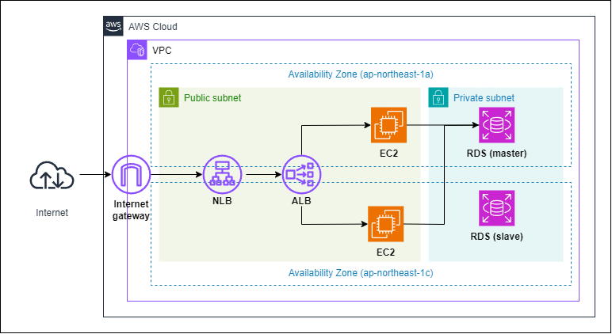

# standard-iaas-website
EC2上でWordPressをセットアップします。  
WordPressの初期設定をユーザーデータで行うので、構築が完了した段階でWordPressが利用できます。  
またEC2へ`ssh`か`Session Manager`で接続可能です。

# 構成図
<p>

</p>


# 使い方

(1) variables.tf に設定値(default)を追記します。
```
variable "rds_password" {
  type    = string
  default = "XXXXXX"
}

variable "wp_password" {
  type    = string
  default = "XXXXXX"
}

variable "email" {
  type    = string
  default = "XXXXXX@gmail.com"
}
```

(2) 以下の順でリソースを作成してください。
```
$ terraform init
$ terraform apply -target=module.vpc -target=module.iam_role -target=module.sg -target=module.sg_rule -target=module.key_pair -target=module.rds
$ terraform apply -target=module.ec2
$ terraform apply
```

(3) Outputs:に出力されたコマンドでWebサイトへ接続します。
```
$ terraform output
```
```
CURL_TO_NLB     = "curl ${module.elb.nlb.dns_name}"
LOGIN_ADMIN_URL = "${module.elb.nlb.dns_name}/wp-login.php"
```

(4),以下の順でリソースを削除してください。
```
$ terraform destroy --target=module.elb
$ terraform destroy
```

# ライセンス
[Mozilla Public License v2.0](https://github.com/Lamaglama39/terraform-for-aws/blob/main/LICENSE)
