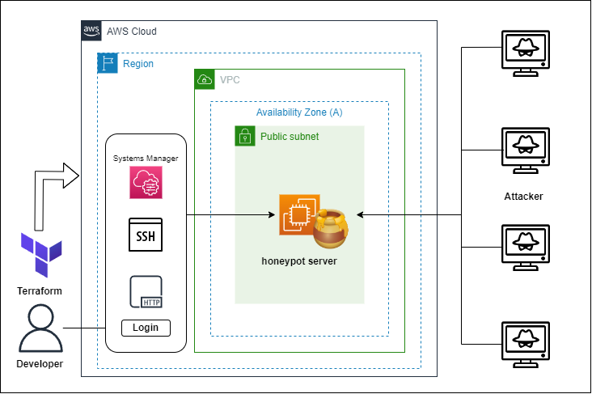

# terraform-honeypot
ハニーポット用のEC2を作成します。
<br>
T-Potを利用しており、EC2立ち上げ後はそのまま利用できるので存分に攻撃されてください。
<br>
なお詳しい使い方は公式リポジトリをご参照ください。

[🍯T-Pot 公式リポジトリ🍯](https://github.com/telekom-security/tpotce)


# 構成図
<p>

</p>

# 使い方

(1) variables.tfで各設定値(ユーザー名、パスワードなど)を設定してください。
<br>
　※インスタンスタイプはxlarge以下だとWebUIでエラーが発生する可能性があり、変更は非推奨です

```
variable "web_user" {
  type = string
  default     = "Tpot_web_user"
  description = "web user name"
}

variable "web_password" {
  type = string
  default = "Tpot_web_password"
  description = "web user password"
}
```

(2) terraformコマンドでapplyします。
```
$ terraform init
$ terraform apply
```

(3) Outputs:に出力されたWebUIのURLに接続します。
```
ssh_command = "https://XX.XX.XX.XX:64294"
ssm_command = "aws ssm start-session --target i-XXXXXXXXXXXX --region ap-northeast-1"
web_ui = "https://XX.XX.XX.XX:64297"
```

(4) variables.tfで設定したユーザー名とパスワードでログインしてください。

# ライセンス
[Mozilla Public License v2.0](https://github.com/Lamaglama39/terraform-for-aws/blob/main/LICENSE)

# 素材クレジット
- <a target="_blank" href="https://icons8.com/icon/WncR8Bcg5nE9/terraform">Terraform</a> icon by <a target="_blank" href="https://icons8.com">Icons8</a>
- <a target="_blank" href="https://icons8.com/icon/yi0RUET3KddF/honey-pot">Honey Pot</a> icon by <a target="_blank" href="https://icons8.com">Icons8</a>
- <a target="_blank" href="https://icons8.com/icon/5503/%E3%83%8F%E3%83%83%E3%82%AD%E3%83%B3%E3%82%B0">ハッキング</a> icon by <a target="_blank" href="https://icons8.com">Icons8</a>