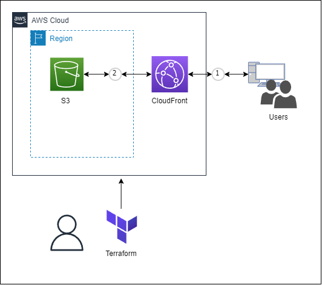

# terraform-static-content
S3とCloudFrontを利用した、シンプルな静的コンテンツを配信します。
<br>
HTTPSでWebサイトを公開したい！でもドメイン名をとるほどのものではない...。
<br>
そんなときにご利用ください。

# 構成図
<p>

</p>

# 使い方

(1)「./contents/」配下にコンテンツ用のリソースを配置します。
```
example.html
example.css
```

(2)「contents.tf」に配置したリソースのパスを追加します。
```
resource "aws_s3_object" "html-object" {
  bucket = aws_s3_bucket.bucket.id
  key = "example.html"
  source = "contents/example.html"
  content_type = "text/html"
  etag = filemd5("contents/example.html")
}
resource "aws_s3_object" "css-object" {
  bucket = aws_s3_bucket.bucket.id
  key = "example.css"
  source = "contents/example.css"
  content_type = "text/css"
  etag = filemd5("contents/example.css")
}
```

(3)terraformコマンドでapplyします。
```
$ terraform init
$ terraform apply
```

(4)「Outputs:」に出力されるドメイン名にアクセスしましょう。
```
aws_cloudfront_distribution_domain_name = "XXXXXXXXXXXXX.cloudfront.net"
```

# ライセンス
[Mozilla Public License v2.0](https://github.com/Lamaglama39/terraform-for-aws/blob/main/LICENSE)

# 素材クレジット
- <a target="_blank" href="https://icons8.com/icon/WncR8Bcg5nE9/terraform">Terraform</a> icon by <a target="_blank" href="https://icons8.com">Icons8</a>