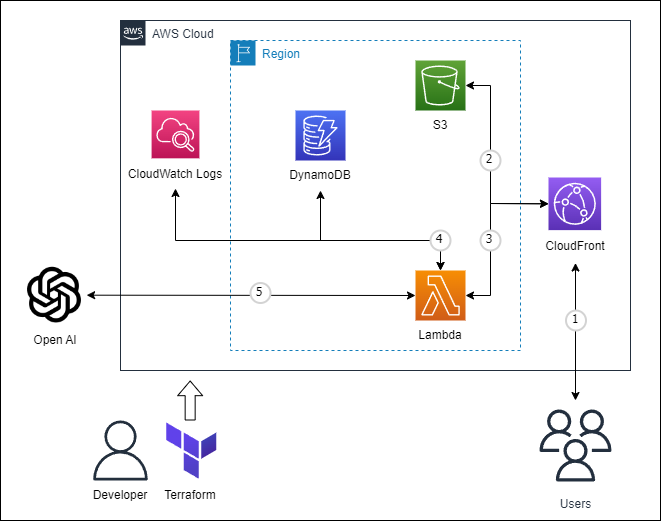

# terraform-openai-serverless
OpenAIを利用したサーバレス構成の簡単なChatアプリを構築できます。
<br>
APIさえ取得していればすぐに利用できます。

# 構成図
<p>

</p>

# 使い方

(1)variables.tfの以下変数に値を設定します。
```
# クレデンシャル情報
variable "API_Key" {}
variable "API_ENDPOINT" {}
```

(2)terraformコマンドでapplyします。
```
$ terraform init
$ terraform apply
```

(3)Outputs:に出力されたURLにアクセスして、Open AIとお話ししましょう。
```
aws_cloudfront_distribution_domain_name = "https://XXXXXXXXXXXXXX.cloudfront.net/"
```

# ライセンス
[Mozilla Public License v2.0](https://github.com/Lamaglama39/terraform-for-aws/blob/main/LICENSE)

# 素材クレジット
- <a target="_blank" href="https://icons8.com/icon/fO5yVwARGUEB/chatgpt">ChatGPT</a> icon by <a target="_blank" href="https://icons8.com">Icons8</a>