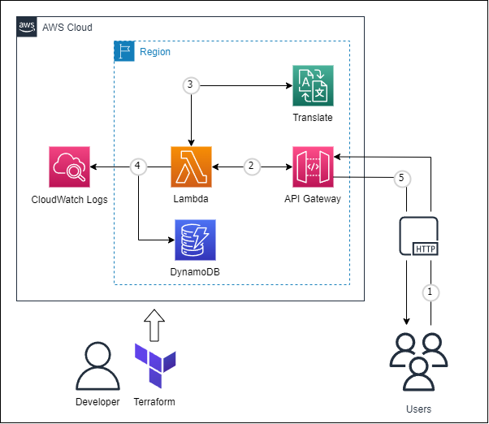

# terraform-translate-serverless
サーバーレス構成の翻訳APIを作成できます。
<br>
お察しの通り、AWS公式ハンズオンをそのままTerraform化したものです...。
<br>
基本的なREST APIを実装できるので、Lambda関数の処理を変更することで様々な応用が効きます。

# 構成図
<p>

</p>

# 使い方

(1)terraformコマンドでapplyします。
```
$ terraform init
$ terraform apply
```

(2)Outputs:に出力されたURLをクリックし、
<br>
　「input_text」で指定した文章が正常に翻訳されることを確認してください。
```
aws_api_gateway_deployment_invoke_url = "https://XXXXXXXX.execute-api.ap-northeast-1.amazonaws.com/dev/translate?input_text=こんにちは"
```
成功例：
```
{"output_text": "Hi"}
```

# ライセンス
[Mozilla Public License v2.0](https://github.com/Lamaglama39/terraform-for-aws/blob/main/LICENSE)

# 素材クレジット
- <a target="_blank" href="https://icons8.com/icon/WncR8Bcg5nE9/terraform">Terraform</a> icon by <a target="_blank" href="https://icons8.com">Icons8</a>