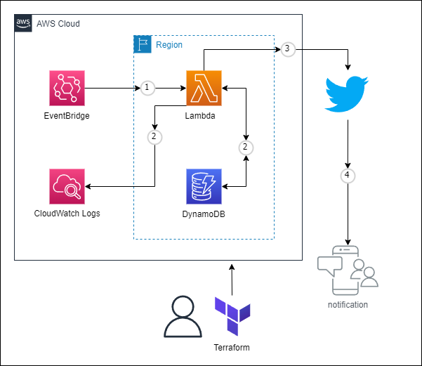

# terraform-twitter-bot

シンプルなサーバーレス構成で Twitter Bot を作成します。
<br>
ツイート内容を設定するだけで、ランダムにツイートする Bot が作成できます。
<br>
また内容ごとにツイートされる優先度なども設定できます。

# 構成図

<p>

</p>

# 事前準備

- Twitter Developers で開発者アカウントを作成し、クレデンシャル情報を取得してください。
  <br>
  正直これが一番大変ですが、頑張ってください...。
  <br>
  [Twitter Developers](https://developer.twitter.com/en)

# 使い方

(1)「variables.tf」に Twitter クレデンシャル情報を設定します。

```
# twitter key,token
variable "api_key" {}
variable "api_secret_key" {}
variable "acces_token" {}
variable "acces_token_secrete" {}
```

(2)「./conf/source.csv」に CSV 形式で通知したい内容を追記します。
<br>
　右から「本文」、「説明内容」、「Twitter の頻度(weight)」の設定です。
<br>
　 weight が高いほどツイートされる優先度が高くなります。

```
contents1,description1,1
contents2,description2,1
contents3,description3,1
```

(3)「terraform.sh」を実行して、デプロイします。

```
$ bash terraform.sh
```

(4)Outputs:に出力された Lambda 名を、以下のコマンドで実行して成功することをテストしてください。
<br>
　またTwitterアカウントにてツイートされていることを確認してください。

```
$ aws lambda invoke --function-name ${lambda-name} --payload '{ "name": "test" }' response.json
```

成功例：

```
{
    "statusCode": 200,
    "body": "\"SUCCESS\"",
    "date": "2023-XX-XX XX:XX:XX",
    "contents": "contents1\description1\n\n(2023/XX/XX XX:XX:XX)"
}
```

# ライセンス

[Mozilla Public License v2.0](https://github.com/Lamaglama39/terraform-for-aws/blob/main/LICENSE)

# 素材クレジット

- <a target="_blank" href="https://icons8.com/icon/WncR8Bcg5nE9/terraform">Terraform</a> icon by <a target="_blank" href="https://icons8.com">Icons8</a>
- <a target="_blank" href="https://icons8.com/icon/13963/twitter">Twitter</a> icon by <a target="_blank" href="https://icons8.com">Icons8</a>
