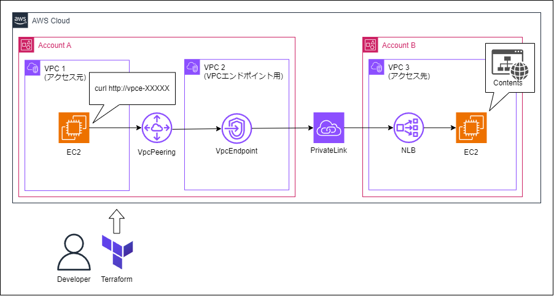

# vpcendpoint-access-via-vpcpeering
VPCピアリング経由で、別のVPCのPrivateLinkを利用する構成です。
<br>
マルチアカウント構築の検証などでご利用ください。


# 構成図
## ①AssumeRoleを利用しないパターン
<p>

</p>

# 使い方

(1) Terraform実行環境の$HOME/.aws/configに、デプロイ用の各アカウントのIAMロールを設定してください。
```
[default]
region=ap-northeast-1
output=json

[profile account1]
role_arn = arn:aws:iam::<アカウント①ID>:role/<IAM Role名>
source_profile = default

[profile account2]
role_arn = arn:aws:iam::<アカウント②ID>:role/<IAM Role名>
source_profile = default
```


(2) providers.tfのprofileに、$HOME/.aws/configで設定したProfile名を設定してください。
```
# アカウント1用のプロバイダー
provider "aws" {
  alias   = "account1"
  region  = "ap-northeast-1"
  profile = "account1"
}

# アカウント2用のプロバイダー
provider "aws" {
  alias   = "account2"
  region  = "ap-northeast-1"
  profile = "account2"
}
```

(3) terraformコマンドでapplyします。
```
$ terraform init
$ terraform apply
```

(4) Outputs:に出力された以下のコマンドを実行して、アクセス元のEC2へ接続します。
```
Connection_source_ec2 = "aws ssm start-session --target ${aws_instance.ec2_1.id} --region ap-northeast-1"
```

(5) Outputs:に出力された以下のコマンドを実行して、PrivateLink経由でアクセス先のEC2からレスポンスが返ってくることを確認してください。
```
access_test_command = "curl http://${aws_vpc_endpoint.privateLink.dns_entry[0].dns_name}"
```


# ライセンス
[Mozilla Public License v2.0](https://github.com/Lamaglama39/terraform-for-aws/blob/main/LICENSE)